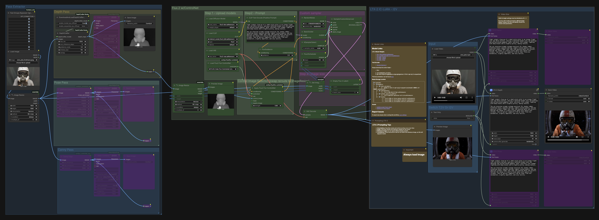
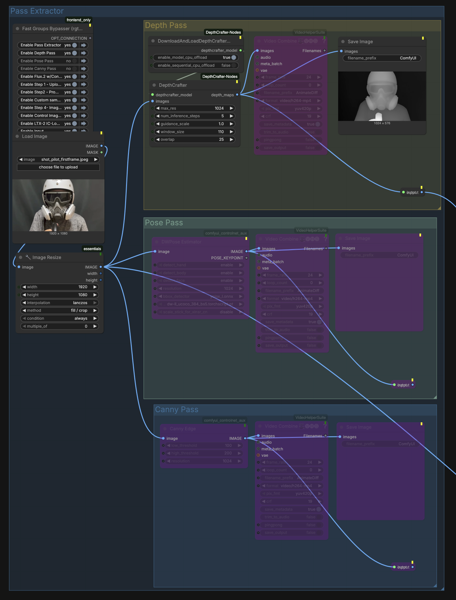

# LTX-2 IC-LoRA I2V + FLUX.2 ControlNet Pass Extractor (ComfyUI)

ComfyUI workflow for **Image-to-Video (I2V)** using an **LTX-2 IC-LoRA** pipeline, enhanced with a **FLUX.2 Fun ControlNet Union** block fed by auto-extracted control passes (**Depth / Pose / Canny**).

## Preview

## What this does
- Input: single image
- Extracts control hints: Depth (DepthCrafter), Pose (DWPose), Canny edges
- Lets you pick one hint (Depth OR Pose OR Canny) as the ControlNet guidance image
- Runs an **LTX-2 IC-LoRA** I2V workflow alongside **FLUX.2 ControlNet Union** guidance

## Files
- workflows/ltx2-ic-lora-flux2-controlnet-i2v.json  
  Main combined workflow (LTX2 IC-LoRA + FLUX.2 pass extractor + Fun ControlNet Union)

Optional:
- workflows/Flux2_ControlNet_with_PassExtractor.json  
  Standalone pass extractor + FLUX.2 CN block
- images/  
  Screenshots / examples

## Requirements

### ComfyUI
A ComfyUI setup that already runs your LTX-2 IC-LoRA workflow successfully.

### Custom nodes / extensions
Install these (ComfyUI Manager recommended):

- FLUX2 Fun ControlNet nodes  
  https://github.com/bryanmcguire/comfyui-flux2fun-controlnet/tree/master

- ControlNet Auxiliary Preprocessors (DWPose + Canny)  
  https://github.com/Fannovel16/comfyui_controlnet_aux

- DepthCrafter nodes (Depth)  
  https://github.com/akatz-ai/ComfyUI-DepthCrafter-Nodes

Optional (only if your workflow includes these nodes):
- VideoHelperSuite (VHS_VideoCombine previews)  
  https://github.com/Kosinkadink/ComfyUI-VideoHelperSuite
- rgthree-comfy (QoL helpers)  
  https://github.com/rgthree/rgthree-comfy
- ComfyUI_essentials (ImageResize+ / GetImageSize+)  
  https://github.com/cubiq/ComfyUI_essentials

### Model weights
- ControlNet: FLUX.2-dev-Fun-Controlnet-Union  
  https://huggingface.co/alibaba-pai/FLUX.2-dev-Fun-Controlnet-Union
- Your LTX-2 base weights + LoRA(s) required by the IC-LoRA workflow
- DepthCrafter + DWPose weights (handled by their respective node packs)

## License note (important)
The FLUX.2 ControlNet Union checkpoint is released under a **non-commercial** license on Hugging Face.  
This repo contains workflow + documentation only. Do NOT upload model weights here, and follow upstream license terms.

## How to use
1) Install required custom nodes (see Requirements).
2) Download the FLUX.2 ControlNet Union model from HF and place it where your ComfyUI expects ControlNet models.
3) Load the workflow JSON from `workflows/` in ComfyUI.
4) Drop your source image into the workflow’s Load Image node(s).
5) Drop your source video input into the LTX-2 input node and choose which pass to work with.
6) Set prompt for image.
7) Set prompt for video.
8) Queue the graph.

### Switching control type (Depth / Pose / Canny)
- Generate the passes (Depth/Pose/Canny).
- Connect only one selected pass output (Depth OR Pose OR Canny) into the image input that feeds the FLUX2 Fun ControlNet Apply node.
- Queue the graph.

## Troubleshooting
- Red “missing node” boxes: install the matching custom node repo listed above.
- Different machines/VMs: ensure the same custom nodes are installed and model paths match.
- Pose is slow: comfyui_controlnet_aux supports faster backends (see their docs).

## Credits / references
- Model: https://huggingface.co/alibaba-pai/FLUX.2-dev-Fun-Controlnet-Union
- Nodes: https://github.com/bryanmcguire/comfyui-flux2fun-controlnet/tree/master
- Preprocessors: https://github.com/Fannovel16/comfyui_controlnet_aux
- Depth: https://github.com/akatz-ai/ComfyUI-DepthCrafter-Nodes
